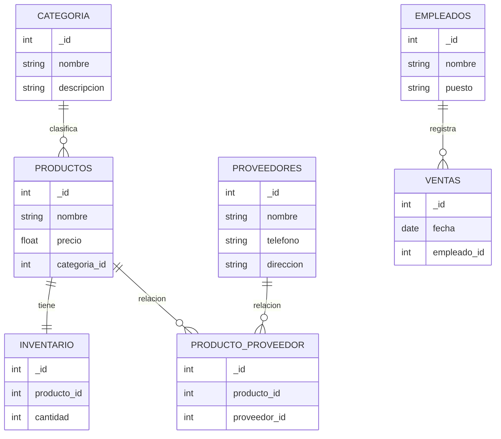

# 🛒 Tienda Variada - Base de Datos MongoDB

Proyecto de base de datos NoSQL desarrollado con **MongoDB Atlas** para gestionar la información de una tienda con diferentes categorías de productos, inventario, ventas, empleados y proveedores.

---

# 📦 Base de Datos

**Nombre de la base de datos**

```
tienda_variada
```

**Connection String**

```
mongodb+srv://dectorserranodaianam3s2_db_user:<db_password>@cluster0.xxxxx.mongodb.net/tienda_variada
```

⚠️ La contraseña se mantiene oculta por seguridad.

---

# 🧰 Tecnologías Utilizadas

* MongoDB Atlas
* MongoDB Compass
* MongoDB Shell
* Node.js (para conexión)
* GitHub
* Mermaid (diagramas)

---

# 📂 Colecciones de la Base de Datos

La base de datos contiene las siguientes colecciones:

| Colección   | Descripción                  |
| ----------- | ---------------------------- |
| categoria   | Clasificación de productos   |
| productos   | Información de los productos |
| inventario  | Control de stock             |
| ventas      | Registro de ventas           |
| empleados   | Información de empleados     |
| proveedores | Proveedores de productos     |

---

# 📊 Modelo Entidad-Relación



---

# 🔄 Relación Muchos a Muchos

Existe una relación **Muchos a Muchos (N:N)** entre:

**Productos ↔ Proveedores**

Esto significa:

* Un **producto** puede tener varios **proveedores**.
* Un **proveedor** puede suministrar varios **productos**.

Para representar esta relación se utiliza la colección intermedia:

```
producto_proveedor
```

| producto_id | proveedor_id |
| ----------- | ------------ |

---

# 🚀 Ejemplo de Conexión (Node.js)

```javascript
const { MongoClient } = require("mongodb");

const uri = "mongodb+srv://dectorserranodaianam3s2_db_user:<db_password>@cluster0.xxxxx.mongodb.net/tienda_variada";

const client = new MongoClient(uri);

async function conectar() {
    await client.connect();
    console.log("Conectado a MongoDB Atlas");
}

conectar();
```

---

# 📊 Estructura de la Base de Datos

```
tienda_variada
│
├── categoria
├── productos
├── inventario
├── ventas
├── empleados
└── proveedores
```

---

# 👥 Miembros del Equipo


---

# 👩‍💻 Autor

Proyecto desarrollado como práctica de **modelado de bases de datos NoSQL utilizando MongoDB Atlas**.

<p align="center">
