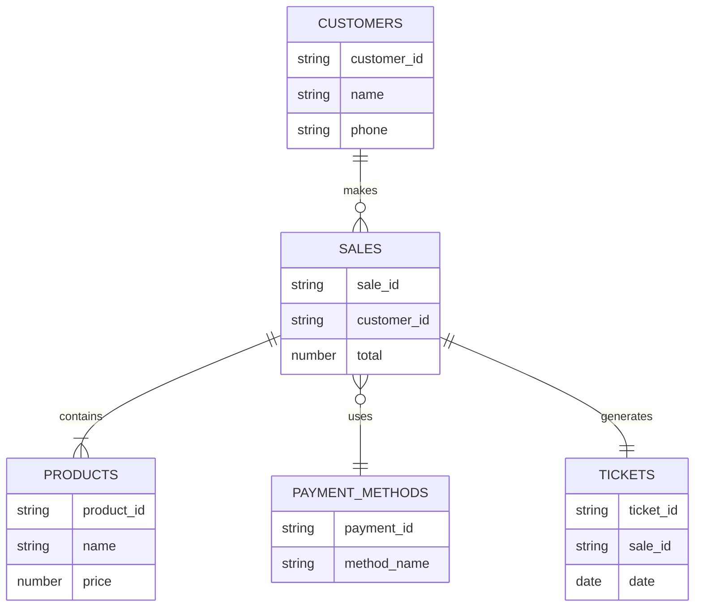

<div align="center">

</p>
<div align="center">

# 🌸 Varied Store 🌸

### ✿ Database Project ✿


</div>

<div style="background-color:#FFD6E8; padding:20px; border-radius:15px">

---

🌸 ───── ✿ ───── 🌸

## 🌼 Team Members

* **Blanca Paolette Calvo Lara** – Data Modeler
* **Vanessa Aponte Morales** – Query Developer
* **Daiana Angelica Dector Serrano** – Integration Specialist
* **Valentina Contreras Hernandez** – Data Seeder / QA

---

🌸 ───── ✿ ───── 🌸

## 📌 Project Description

This project consists of the design and implementation of a **MongoDB database** that simulates the operation of a **varied store**.

The system manages different product categories and records customer purchases, payment methods, and sales tickets.

The categories included in the store are:

* 🧺 White Goods
* 👕 Clothing
* 🧸 Toys
* 💻 Electronics
* 🪑 Furniture
* ⚽ Sports

The objective is to demonstrate the implementation of **NoSQL database modeling**, using **embedding and referencing strategies**.

---

🌸 ───── ✿ ───── 🌸

## 💡 Why did we choose this topic?

We chose this project because we believe that **online shopping platforms make purchasing products easier and more accessible**.

Our application simulates a store where users can browse different categories, purchase products, and generate tickets without leaving the comfort of their home.

This project also allows us to demonstrate **database design, data modeling, and query development using MongoDB**.

---

🌸 ───── ✿ ───── 🌸

## 🗂 Database Model



This diagram represents the **structure of the database** and the relationships between the main entities of the system.
## Database Diagram Preview

<p align="center">

</p>

This preview represents the structure of the store database.
---

🌸 ───── ✿ ───── 🌸

## 🧩 Embedding Strategy

In this project we use **embedding** to store related data inside the same document.

Example:

```json
{
 "sale_id": "S001",
 "customer": {
   "customer_id": "C001",
   "name": "Juan Perez"
 },
 "products": [
   {
     "product_id": "P01",
     "name": "Laptop",
     "price": 15000
   },
   {
     "product_id": "P02",
     "name": "Mouse",
     "price": 250
   }
 ],
 "total": 15250
}
```

Embedding improves performance because **related information can be retrieved in a single query**.

---

🌸 ───── ✿ ───── 🌸

## 🔗 Referencing Strategy

We also apply **referencing** when it is necessary to keep data in separate collections.

Example:

```json
{
 "sale_id": "S001",
 "customer_id": "C001",
 "payment_method_id": "PM01"
}
```

The referenced data is stored in other collections such as:

* Customers
* Products
* Payment Methods

This approach helps maintain **data normalization and flexibility**.

---

🌸 ───── ✿ ───── 🌸

## 📂 Project Structure

```
VariedStore
│
├── database
│   ├── collections.js
│   ├── seed_data.js
│
├── queries
│   ├── sales_queries.js
│   ├── product_queries.js
│
├── diagrams
│   └── er_diagram.md
│
└── README.md
```

This structure organizes the project into **database configuration, queries, and documentation**.

---

🌸 ───── ✿ ───── 🌸

## ⚙️ How to Run the Project

1. Install **MongoDB**
2. Clone the repository

```
git clone https://github.com/dectorserranodaianam3s2-creator/Tiendavariada-.git
```

3. Insert seed data into the database
4. Execute queries to simulate store operations

---

🌸 ───── ✿ ───── 🌸

## 🚀 Future Improvements

Possible improvements for future versions:

* Add a **web interface**
* Implement **user authentication**
* Integrate **inventory management**
* Connect the database to a **full web application**

---

🌸 ───── ✿ ───── 🌸

## 🤖 AI Usage Statement

The development team certifies that **AI tools were used only as mentors** to explain concepts and help debug errors.

All code and project decisions were **reviewed, validated, and implemented by the team members**.

Signature:
**Development Team No. 11**

---

🌸 ───── ✿ ───── 🌸

## 🏷 Version

**Release v1.0**

</div>

<p align="center">

🌸 Thank you for visiting our repository 🌸

</p>


<p align="center">
