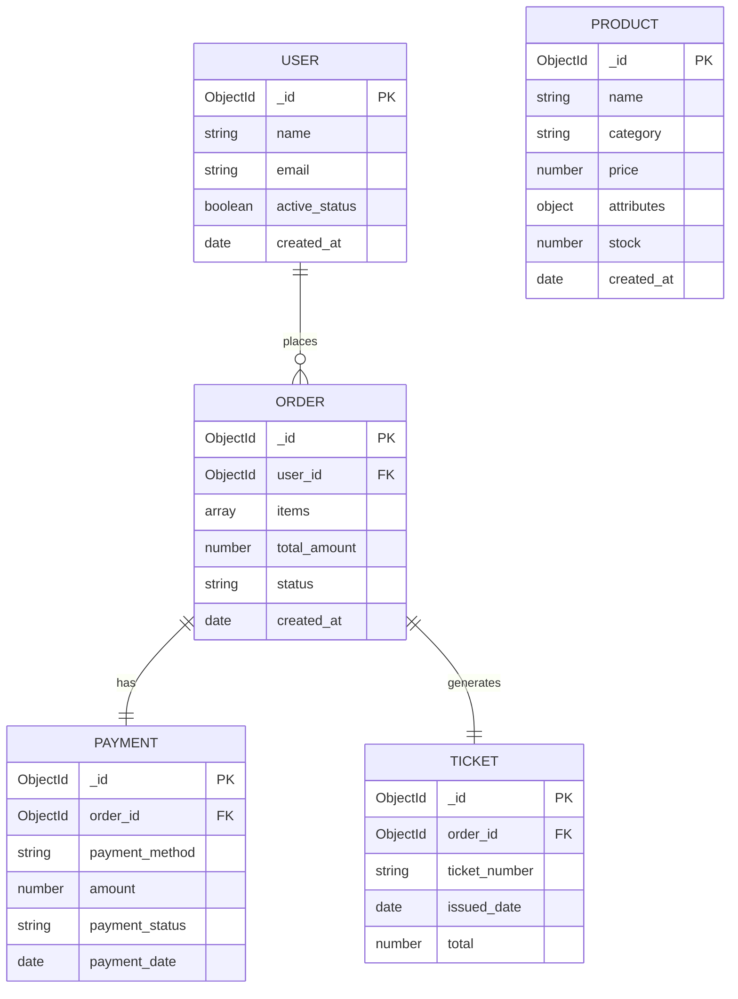

# 📊 Schema Design – Tienda Variada

## Entity Relationship Diagram

---

## 📌 Design Explanation

This schema represents a variety store system using MongoDB.

- A USER places multiple ORDERS.
- Each ORDER generates one PAYMENT.
- Each ORDER generates one TICKET.
- PRODUCTS are included inside the ORDER as an embedded array (items).

MongoDB allows flexible schemas, especially for the PRODUCT collection, where the "attributes" field can change depending on the category (clothing or electronics).

This demonstrates a polymorphic design approach.
